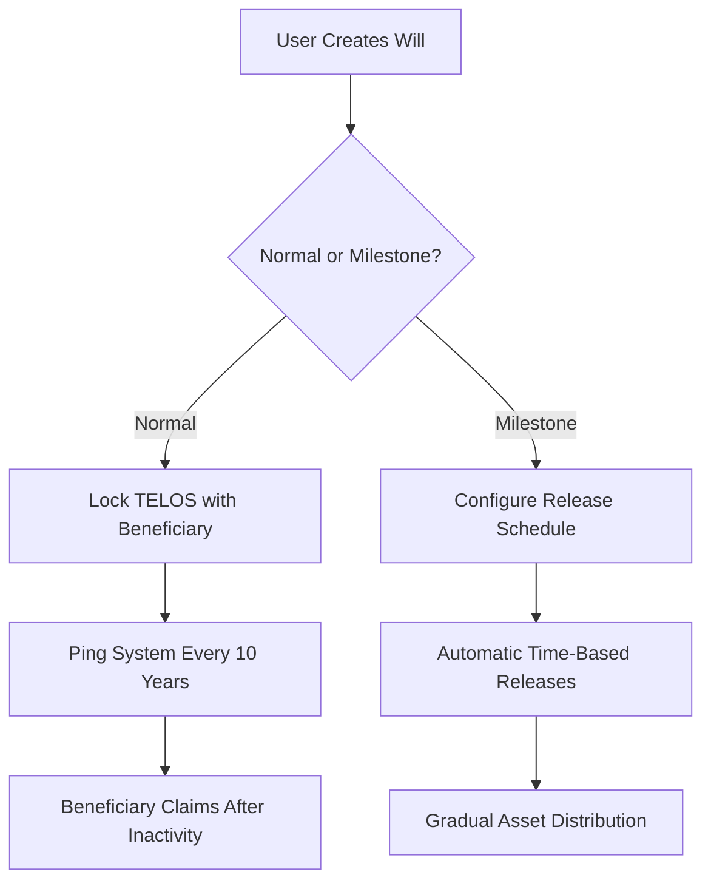

# Inherify - Secure Your Legacy

## Overview 🚀
Losing private keys and seed phrases is a nightmare—you lose your assets forever. But what if there was a solution to keep a specific share of your assets safe and make it claimable by your trusted ones or even your other wallet?

**Inherify** is a blockchain-based estate planning solution built on the secure and scalable **Telos blockchain**. The **Smart Will** leverages smart contracts to automate, protect, and securely execute your will upon predefined conditions.

## Key Features ✨

### **🛡️ Dual Will System**
- **Normal Wills**: Single-beneficiary with a 10-year inactivity lock
- **Milestone Wills**: Multi-phase distributions with custom triggers

### **⏰ Time-Based Automation**
- 10-year activity check (resettable via `ping()`)
- 1-year withdrawal cooldown period
- Milestone-specific release schedules

### **🔒 Built-in Protections**
- Immutable beneficiary assignments
- Anti-frontrunning design
- Platform fee collection on creation
- Claim validation safeguards

## Developer Integration 🧐

### Installation
```bash
npm install @openzeppelin/contracts ethers
```

### **Claiming as a Beneficiary**
Here’s a function that allows beneficiaries to check their claimable wills:
```solidity
function getNormalWillAsBeneficiary(address _beneficiary) external view returns (address[] memory owners, uint256[] memory amounts) {
    uint256 count = 0;
    for (uint256 i = 0; i < willOwners.length; i++) {
        address user = willOwners[i];
        if (hasNormalWill[user] && normalWills[user].beneficiary == _beneficiary && !normalWills[user].isClaimed) {
            count++;
        }
    }
    owners = new address[](count);
    amounts = new uint256[](count);
    uint256 index = 0;
    for (uint256 i = 0; i < willOwners.length; i++) {
        address user = willOwners[i];
        if (hasNormalWill[user] && normalWills[user].beneficiary == _beneficiary && !normalWills[user].isClaimed) {
            owners[index] = user;
            amounts[index] = normalWills[user].amount;
            index++;
        }
    }
    return (owners, amounts);
}
```

## User Flow Diagram 📊



## Security Architecture 🛡️

1. **Fund Locking**: Assets held in contract until conditions are met
2. **Temporal Validation**:
   - 10-year inactivity window for normal wills
   - Time-based milestone releases
   - 1-year withdrawal cooldown
3. **Identity Verification**:
   - Beneficiary ≠ Owner
   - Claimant signature validation
4. **Financial Safeguards**:
   - Percentage-based releases (<=100%)
   - Anti-overclaim protection
   - Platform fee deduction on creation

## Maintenance Operations 🔄

- **Withdraw Funds (After 1 Year)**
- **Update Beneficiary**
- **Reset Activity Timer**

## Future Enhancements 🌍
- **Cross-Chain Support**: Expanding Inherify beyond Telos
- **NFT Deposits**: Secure digital collectibles alongside crypto assets
- **Improved Block Explorer**: Enhanced transparency via AURA++

## Contribution Guidelines 🤝
We welcome contributions! Please follow our workflow:
1. Fork repository
2. Create feature branch (`git checkout -b feature/AmazingFeature`)
3. Commit changes (`git commit -m 'Add AmazingFeature'`)
4. Push to branch (`git push origin feature/AmazingFeature`)
5. Open a Pull Request

## License 📝
MIT Licensed - See [LICENSE](https://opensource.org/licenses/MIT) for details.

---

**Inherify** - Redefining legacy planning through blockchain technology. Secure your legacy today! 🔗
